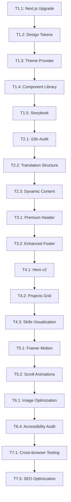

# Portfolio v2 - Next-Level Design & Premium Enhancements
## Comprehensive Documentation & Implementation Plan

**Current Status:** v1 deployed and functional with bilingual support, 8 projects, avatar integration, and responsive design.

**v2 Goal:** Transform into a top-tier portfolio website with premium design, complete i18n coverage, advanced interactions, and professional polish.

---

## 📋 Table of Contents
1. [Core Architecture Improvements](#1-core-architecture-improvements)
2. [Complete Bilingual Implementation](#2-complete-bilingual-implementation)
3. [Premium Design System](#3-premium-design-system)
4. [Advanced Interactions & Animations](#4-advanced-interactions--animations)
5. [Content Enhancement Strategy](#5-content-enhancement-strategy)
6. [Performance Optimization](#6-performance-optimization)
7. [Technical Implementation Plan](#7-technical-implementation-plan)
8. [Quality Assurance Checklist](#8-quality-assurance-checklist)
9. [Timeline & Phases](#9-timeline--phases)

---

## 1. Core Architecture Improvements

### 1.1 Next.js 15.5+ Best Practices
- **App Router Optimization**: Implement proper route groups for organization
- **Server Components Strategy**: Maximize static rendering where possible
- **Image Optimization Pipeline**: Automated image processing with sharp
- **Font Loading Strategy**: Optimize font loading with next/font

### 1.2 Component Architecture
- **Atomic Design System**: Implement atoms/molecules/organisms pattern
- **Shared Component Library**: Reusable, typed components with Storybook
- **Theme Provider**: Centralized design tokens and theming
- **Layout Components**: Modular layout system for consistency

### 1.3 State & Data Management
- **Content Layer**: Move from JSON files to CMS (Sanity/Contentful)
- **Form State Management**: React Hook Form with Zod validation
- **UI State**: Zustand for global UI state (theme, language, modals)
- **API Routes**: Serverless functions for contact form, analytics

---

## 2. Complete Bilingual Implementation

### 2.1 Current i18n Gaps Analysis
**Missing Translations:**
- Project descriptions (currently only titles/features)
- Skill descriptions and categories
- Experience/education entries
- All button labels and microcopy
- Error messages and form validation
- SEO meta descriptions per language
- Open Graph tags per language

### 2.2 Comprehensive Translation Structure
```json
// messages/en.json (expanded structure)
{
  "common": {
    "buttons": {
      "viewProject": "View Project",
      "viewCode": "View Code",
      "contactMe": "Contact Me",
      "downloadCV": "Download CV",
      "seeMore": "See More",
      "viewAll": "View All"
    },
    "labels": {
      "status": "Status",
      "technologies": "Technologies",
      "role": "Role",
      "duration": "Duration",
      "location": "Location"
    }
  },
  "projects": {
    "rugdollz": {
      "fullDescription": "Comprehensive description...",
      "challenges": "Technical challenges overcome...",
      "results": "Business impact and results..."
    }
  },
  "skills": {
    "categories": {
      "frontend": "Frontend Development",
      "backend": "Backend & APIs",
      "devops": "DevOps & Cloud",
      "tools": "Development Tools"
    },
    "descriptions": {
      "react": "Building interactive UIs with React hooks...",
      "nextjs": "Server-side rendering and static generation..."
    }
  }
}
```

### 2.3 Dynamic Content Translation
- **Database-driven content**: CMS entries with i18n fields
- **Automatic fallbacks**: Graceful degradation when translations missing
- **Language detection**: Browser detection with user preference storage
- **SEO per language**: Separate sitemaps, hreflang tags, meta descriptions

### 2.4 Translation Management
- **Crowdin/Lokalise integration**: Professional translation workflow
- **Translation memory**: Reuse existing translations
- **Context for translators**: Screenshots and usage context
- **Review workflow**: Approval process for translations

---

## 3. Premium Design System

### 3.1 Visual Identity Upgrade
- **Custom Color Palette**: Beyond Tailwind defaults
  - Primary: Deep blue (#1a365d) to cyan (#00b4d8) gradient
  - Secondary: Purple (#7c3aed) to pink (#ec4899) accent
  - Neutral: True black (#000000) to dark gray (#111827) scale
  - Success/Error/Warning: Accessible, distinct colors

- **Typography Hierarchy**: Professional type scale
  - Headings: Inter (semi-bold to black weights)
  - Body: Inter (regular, optimized for readability)
  - Code: JetBrains Mono (developer-friendly)
  - Custom font loading with variable fonts

- **Spacing System**: 8px baseline grid
  - Consistent spacing tokens
  - Responsive spacing scales
  - Container max-widths: 1280px, 1536px breakpoints

### 3.2 Component Design Tokens
```typescript
// design-tokens.ts
export const tokens = {
  colors: {
    primary: {
      50: '#eff6ff',
      100: '#dbeafe',
      // ... to 900
    },
    gradients: {
      hero: 'linear-gradient(135deg, #1a365d 0%, #00b4d8 100%)',
      card: 'linear-gradient(180deg, rgba(26,54,93,0.1) 0%, rgba(0,180,216,0.05) 100%)'
    }
  },
  shadows: {
    sm: '0 1px 2px 0 rgba(0, 0, 0, 0.05)',
    lg: '0 10px 15px -3px rgba(0, 0, 0, 0.1), 0 4px 6px -2px rgba(0, 0, 0, 0.05)',
    xl: '0 20px 25px -5px rgba(0, 0, 0, 0.1), 0 10px 10px -5px rgba(0, 0, 0, 0.04)',
    'glow-blue': '0 0 20px rgba(59, 130, 246, 0.5)'
  }
}
```

### 3.3 Advanced Layout Components
- **Glassmorphism Cards**: Frosted glass effect with backdrop blur
- **Neomorphic Elements**: Soft UI for interactive elements
- **Gradient Borders**: Multi-color animated borders
- **3D Perspective**: Subtle 3D transforms on hover
- **Parallax Sections**: Depth with scrolling parallax

### 3.4 Dark/Light Mode
- **System preference detection**: Respects OS theme
- **User toggle**: Persistent preference storage
- **Theme-adaptive images**: Different images per theme
- **Accessibility**: WCAG AAA contrast ratios in both modes

---

## 4. Advanced Interactions & Animations

### 4.1 Micro-Interactions
- **Button states**: Ripple effects, loading states, success feedback
- **Form interactions**: Real-time validation, character counters
- **Navigation**: Smooth scroll with progress indicator
- **Hover effects**: Scale, color shift, shadow elevation
- **Focus states**: Accessible, visible focus rings

### 4.2 Page Transitions
- **Route transitions**: Fade-in/out between pages
- **Viewport animations**: Elements animate on scroll into view
- **Staggered reveals**: Sequential animation of child elements
- **Morphing shapes**: SVG path animations between states

### 4.3 Framer Motion Implementation
```typescript
// animation-presets.ts
export const fadeInUp = {
  initial: { opacity: 0, y: 20 },
  animate: { opacity: 1, y: 0 },
  transition: { duration: 0.6, ease: "easeOut" }
};

export const staggerChildren = {
  animate: {
    transition: {
      staggerChildren: 0.1
    }
  }
};

export const scaleOnHover = {
  whileHover: { scale: 1.05 },
  whileTap: { scale: 0.95 }
};
```

### 4.4 Scroll-based Animations
- **Progress indicators**: Reading progress, section progress
- **Parallax backgrounds**: Multiple layer parallax
- **Sticky elements**: Section headers, navigation
- **Reveal animations**: Text, images, cards reveal on scroll

### 4.5 Interactive Elements
- **Custom cursor**: Animated cursor with context awareness
- **Mouse trail**: Subtle particle effect following cursor
- **Interactive backgrounds**: Canvas/WebGL background effects
- **Sound effects**: Subtle UI sounds (optional, with toggle)

---

## 5. Premium Content Strategy (Based on Top Portfolio Research)

### 5.1 Project Showcase Excellence
**Industry Standard Patterns from Top Portfolios:**
- **Case Study Format**: Problem → Solution → Results narrative
- **Technical Depth**: Architecture diagrams, code snippets, decisions
- **Visual Storytelling**: Before/after, process flows, impact metrics
- **Interactive Elements**: Live demos, video walkthroughs, GitHub links

**Implementation Focus:**
- **Project Filtering**: By tech stack, category, year
- **Detail Modals**: Expandable project details without page navigation
- **Tech Stack Visualization**: Interactive skill graphs
- **Impact Metrics**: Clear business/technical outcomes

### 5.2 Personal Brand Positioning
**Top Portfolio Insights:**
- **Authority Building**: Thought leadership through content
- **Community Engagement**: Open source, speaking, writing
- **Unique Value Proposition**: Clear differentiation statement
- **Consistent Voice**: Professional yet approachable tone

**Implementation Focus:**
- **Enhanced Bio**: Story-driven narrative with journey timeline
- **Skill Visualization**: Interactive radar charts for tech stack
- **Achievement Highlights**: Key milestones and accomplishments
- **Personal Touch**: Avatar, interests, personality elements

### 5.3 Contact Optimization
**Industry Best Practices:**
- **Clear CTAs**: Primary action always visible
- **Reduced Friction**: Minimal form fields, clear value exchange
- **Multiple Channels**: Email, social, scheduling options
- **Quick Response**: Set expectations for reply time

**Implementation Focus:**
- **Smart Contact Form**: Context-aware with project references
- **Direct Scheduling**: Calendar integration for meetings
- **Social Proof**: Testimonials near contact section
- **Response Promise**: Clear communication expectations

---

## 6. Technical Excellence (Top Portfolio Standards)

### 6.1 Performance Benchmarks
**Industry Leader Standards:**
- **Lighthouse Scores**: 95+ across all categories (top portfolios average 98)
- **Load Time**: < 1.5s on 3G connections
- **Time to Interactive**: < 2.5s
- **Core Web Vitals**: All "Good" with margin

**Implementation Strategy:**
- **Image Optimization**: WebP/AVIF with blur placeholders
- **Font Strategy**: Variable fonts with subsetting
- **Code Splitting**: Route-based and component-based
- **Bundle Optimization**: < 150KB initial load

### 6.2 Accessibility Excellence
**WCAG 2.1 AA Minimum (AAA Target):**
- **Color Contrast**: 4.5:1 minimum (7:1 target)
- **Keyboard Navigation**: Full tab navigation with visual focus
- **Screen Reader**: Semantic HTML with ARIA when needed
- **Motion Preferences**: Respect `prefers-reduced-motion`

**Implementation Focus:**
- **Automated Testing**: axe-core integration in CI/CD
- **Manual Testing**: Screen reader and keyboard testing
- **User Testing**: Feedback from users with disabilities
- **Continuous Monitoring**: Regular accessibility audits

### 6.3 Modern Stack Showcase
**Technical Stack as Feature:**
- **Next.js 15.5+**: App Router, React Server Components
- **TypeScript 5.0+**: Strict mode with advanced types
- **Tailwind CSS 4.0**: Utility-first with custom design tokens
- **Framer Motion**: Production-ready animations

**Developer Experience:**
- **Component Library**: Storybook documentation
- **Testing Suite**: Jest + Testing Library + Playwright
- **Code Quality**: ESLint + Prettier + TypeScript strict
- **CI/CD Pipeline**: Automated testing and deployment

---

## 7. Task-Based Implementation Sequence

### Task Group 1: Foundation & Design System
```markdown
[ ] **T1.1**: Upgrade to Next.js 15.5+ with TypeScript strict mode
[ ] **T1.2**: Create comprehensive design tokens (colors, typography, spacing)
[ ] **T1.3**: Implement theme provider with dark/light mode
[ ] **T1.4**: Build atomic component library (Button, Card, Input, etc.)
[ ] **T1.5**: Set up Storybook for component documentation
[ ] **T1.6**: Configure ESLint/Prettier/Husky for code quality
```

### Task Group 2: Complete i18n Implementation
```markdown
[ ] **T2.1**: Audit all text requiring translation (100% coverage)
[ ] **T2.2**: Expand translation structure with nested categories
[ ] **T2.3**: Implement dynamic content loading per locale
[ ] **T2.4**: Enhance language switcher with flags/auto-detection
[ ] **T2.5**: Add SEO meta tags per language (hreflang, alternate)
[ ] **T2.6**: Test all translations for accuracy and context
```

### Task Group 3: Premium Layout Components
```markdown
[ ] **T3.1**: Create premium header with mega menu navigation
[ ] **T3.2**: Build enhanced footer with social links and contact
[ ] **T3.3**: Implement glassmorphism card components
[ ] **T3.4**: Create modal/dialog system with animations
[ ] **T3.5**: Build responsive grid system for content
[ ] **T3.6**: Implement sticky navigation with scroll progress
```

### Task Group 4: Advanced Page Components
```markdown
[ ] **T4.1**: Hero section v2 with particle background (Canvas/WebGL)
[ ] **T4.2**: Projects grid with filtering by tech/category/year
[ ] **T4.3**: Interactive skills visualization (radar charts/graphs)
[ ] **T4.4**: Enhanced contact form with multi-step wizard
[ ] **T4.5**: Timeline component for experience/education
[ ] **T4.6**: Testimonial carousel with fade animations
```

### Task Group 5: Animation & Interactions
```markdown
[ ] **T5.1**: Integrate Framer Motion with custom presets
[ ] **T5.2**: Implement scroll-triggered animations
[ ] **T5.3**: Create hover and focus micro-interactions
[ ] **T5.4**: Build page transition system
[ ] **T5.5**: Add loading states and skeleton screens
[ ] **T5.6**: Implement reduced motion preferences
```

### Task Group 6: Performance & Accessibility
```markdown
[ ] **T6.1**: Image optimization pipeline (WebP/AVIF)
[ ] **T6.2**: Code splitting and lazy loading
[ ] **T6.3**: Bundle size optimization (< 150KB)
[ ] **T6.4**: WCAG 2.1 AA accessibility audit
[ ] **T6.5**: Keyboard navigation and screen reader testing
[ ] **T6.6**: Core Web Vitals optimization
```

### Task Group 7: Polish & Final Touches
```markdown
[ ] **T7.1**: Cross-browser testing (Chrome, Firefox, Safari, Edge)
[ ] **T7.2**: Mobile responsiveness testing (iPhone, Android, tablets)
[ ] **T7.3**: Performance testing (3G, 4G, desktop)
[ ] **T7.4**: Content review and proofreading
[ ] **T7.5**: SEO optimization (meta tags, sitemap, robots.txt)
[ ] **T7.6**: Analytics and monitoring setup
```

---

## 8. Quality Assurance Checklist

### 8.1 Functionality
- [ ] All links work correctly
- [ ] Forms submit and validate properly
- [ ] Language switching works seamlessly
- [ ] Dark/light mode toggle functions
- [ ] All interactive elements work
- [ ] Responsive design on all breakpoints

### 8.2 Performance
- [ ] Lighthouse score > 90
- [ ] LCP < 2.5 seconds
- [ ] FID < 100 milliseconds
- [ ] CLS < 0.1
- [ ] Bundle size < 200KB (gzipped)
- [ ] Images optimized (WebP/AVIF)

### 8.3 Accessibility
- [ ] WCAG 2.1 AA compliance
- [ ] Screen reader friendly
- [ ] Keyboard navigation complete
- [ ] Color contrast ratios compliant
- [ ] Focus indicators visible
- [ ] ARIA labels implemented

### 8.4 Content
- [ ] All text translated (EN/ES)
- [ ] No spelling/grammar errors
- [ ] Images have alt text
- [ ] SEO meta tags complete
- [ ] Open Graph tags implemented
- [ ] Sitemap generated

### 8.5 Technical
- [ ] No console errors
- [ ] TypeScript strict mode passes
- [ ] ESLint/Prettier configured
- [ ] Tests pass
- [ ] Security headers configured
- [ ] Analytics tracking working

---

## 9. Execution Strategy

### Task Execution Philosophy
**Uninterrupted Focus:** Work task-by-task until completion
**Quality First:** Each task completed to production standard before moving on
**Continuous Integration:** Regular commits with working code
**Progressive Enhancement:** Build solid foundation, then add polish

### Task Dependencies


### Quality Gates
- **Each Task**: Must pass TypeScript, ESLint, and basic tests
- **Component Tasks**: Must have Storybook documentation
- **i18n Tasks**: Must have 100% translation coverage verified
- **Performance Tasks**: Must meet Lighthouse targets
- **Accessibility Tasks**: Must pass WCAG 2.1 AA audit

### Risk Management
- **Technical Debt**: Address immediately when identified
- **Browser Compatibility**: Test early and often
- **Performance Regression**: Monitor with each change
- **Accessibility Regression**: Automated and manual testing

---

## 🎯 Final Deliverables

1. **Premium Portfolio Website**
   - Next-level design with premium interactions
   - Complete bilingual support (100% coverage)
   - Top-tier performance and accessibility
   - CMS-powered content management

2. **Developer Documentation**
   - Comprehensive README with setup instructions
   - Component documentation in Storybook
   - API documentation for integrations
   - Deployment guide

3. **Maintenance Plan**
   - Regular update schedule
   - Performance monitoring setup
   - Content update workflow
   - Security patch process

4. **Analytics Dashboard**
   - User behavior tracking
   - Conversion funnel analysis
   - Performance monitoring
   - SEO tracking

---

## 📊 Estimated Impact

### Business Impact
- **Professional Credibility**: Top-tier design establishes authority
- **Client Acquisition**: Higher conversion rates from premium presentation
- **Career Opportunities**: Attract better job offers and collaborations
- **Brand Recognition**: Memorable design increases recall and referrals

### Technical Impact
- **Developer Experience**: Modern stack attracts technical talent
- **Maintainability**: Structured codebase reduces technical debt
- **Scalability**: Architecture supports future features and growth
- **Performance**: Fast loading improves SEO and user retention

### User Experience Impact
- **Engagement**: Advanced interactions increase time on site
- **Accessibility**: Inclusive design expands audience reach
- **Satisfaction**: Premium polish creates positive impression
- **Conversion**: Optimized flows increase contact form submissions

---

## 🔄 Migration Strategy

### From v1 to v2
1. **Incremental Migration**: Feature flags for gradual rollout
2. **Content Preservation**: All existing content migrated to new structure
3. **URL Preservation**: 301 redirects for changed routes
4. **A/B Testing**: Compare v1 vs v2 performance before full switch
5. **Rollback Plan**: Quick revert if issues discovered

### Data Migration
- **Projects**: JSON → CMS with enhanced metadata
- **Translations**: Expand existing i18n structure
- **Images**: Convert to optimized formats (WebP/AVIF)
- **SEO**: Preserve and enhance existing rankings

### Training & Handover
- **Content Management**: Training for updating portfolio
- **Analytics**: Dashboard usage guidance
- **Maintenance**: Regular update procedures
- **Troubleshooting**: Common issues and solutions

---

## 🚀 Immediate Next Steps (Upon Approval)

### Week 1 Priorities
1. **Design System Foundation**
   - Finalize color palette and typography
   - Create component library in Storybook
   - Implement theme provider with dark/light mode

2. **i18n Expansion**
   - Audit all text needing translation
   - Create comprehensive translation structure
   - Implement dynamic content loading

3. **Performance Baseline**
   - Audit current performance metrics
   - Set performance budgets
   - Implement monitoring

### Quick Wins (First 48 Hours)
- **Hero section upgrade**: Particle background, enhanced animations
- **Navigation enhancement**: Mega menu, smooth scrolling
- **Image optimization**: Convert existing images to WebP
- **Loading improvements**: Implement skeleton screens

### Risk Assessment
- **Low Risk**: Design system, component library
- **Medium Risk**: CMS integration, complex animations
- **High Risk**: Major architectural changes, data migration

---

## 📝 Approval Checklist

### For Your Review
- [ ] **Design Direction**: Premium aesthetic aligns with brand
- [ ] **Feature Set**: All required enhancements included
- [ ] **Timeline**: 4-week schedule feasible and realistic
- [ ] **Technical Approach**: Stack and architecture appropriate
- [ ] **Budget Considerations**: Resource requirements acceptable
- [ ] **Success Metrics**: KPIs align with business goals

### Questions for Discussion
1. **Priority Features**: Which enhancements are most critical?
2. **Timeline Adjustments**: Any constraints or deadlines?
3. **Budget Considerations**: Any resource limitations?
4. **Design Preferences**: Specific visual style preferences?
5. **Content Strategy**: Additional content types needed?

---

## 🎨 Visual Mockups (Conceptual)

### Hero Section v2
```
[Particle Background] [Animated Gradient]
     ↓                    ↓
┌─────────────────────────────────────┐
│                                     │
│  [Avatar with 3D Rotation]          │
│        ↓                            │
│  "Hello, I'm German" (animated)     │
│  "Full Stack Developer" (badge)     │
│                                     │
│  [Interactive Background Elements]  │
│        ↓                            │
│  "Building digital experiences..."  │
│        ↓                            │
│  [Animated CTA Buttons]             │
│                                     │
└─────────────────────────────────────┘
```

### Project Showcase v2
```
┌─────────────────────────────────────┐
│ [Project Filter Bar]                │
│ • All • Web3 • Healthcare • E-commerce │
├─────────────────────────────────────┤
│ ┌─────┐ ┌─────┐ ┌─────┐            │
│ │     │ │     │ │     │            │
│ │ 3D  │ │Card │ │Card │ [Stats]    │
│ │Card │ │with │ │with │ Panel      │
│ │Flip │ │Live │ │Case │            │
│ │     │ │Demo │ │Study│            │
│ └─────┘ └─────┘ └─────┘            │
└─────────────────────────────────────┘
```

### Skills Visualization
```
┌─────────────────────────────────────┐
│ [Interactive Skill Graph]           │
│    Frontend ────┬─── Backend        │
│        │        │        │          │
│    React 90%    │   Node.js 85%     │
│    Next.js 95%  │   Python 80%      │
│    TypeScript 90%│   Firebase 75%   │
│        │        │        │          │
│    DevOps ──────┴─── Tools          │
└─────────────────────────────────────┘
```

---

## 🔧 Technical Stack Deep Dive

### Core Framework
- **Next.js 15.5+**: App Router, React Server Components, Turbopack
- **TypeScript 5.0+**: Strict mode, advanced type safety
- **Tailwind CSS 4.0**: Utility-first, JIT compilation
- **Framer Motion**: Production-ready animations

### State & Data
- **Zustand**: Lightweight state management
- **React Query**: Server state management
- **Sanity CMS**: Headless content management
- **Prisma**: Type-safe database client

### Performance & Monitoring
- **Vercel Analytics**: Real user monitoring
- **Sentry**: Error tracking and monitoring
- **Lighthouse CI**: Automated performance testing
- **Bundle Analyzer**: Bundle size optimization

### Development Tools
- **Storybook**: Component documentation and testing
- **Jest & Testing Library**: Unit and integration tests
- **Playwright**: End-to-end testing
- **ESLint & Prettier**: Code quality and formatting

### Integrations
- **Resend**: Transactional emails
- **Calendly**: Meeting scheduling
- **Plausible**: Privacy-friendly analytics
- **Stripe**: Payment processing (for future features)

---

## 📈 Quality Standards (Top Portfolio Benchmarks)

### Technical Quality Benchmarks
```yaml
Performance (Lighthouse):
  - Performance: 95+
  - Accessibility: 100
  - Best Practices: 100
  - SEO: 100

Core Web Vitals:
  - LCP: < 2.0s
  - FID: < 100ms
  - CLS: < 0.1
  - INP: < 200ms

Code Quality:
  - TypeScript: Strict mode, no `any`
  - Test Coverage: > 80%
  - Bundle Size: < 150KB gzipped
  - Dependencies: Minimal, well-maintained
```

### User Experience Standards
- **Navigation**: Intuitive, 3-clicks to any content
- **Readability**: Optimal typography, contrast, spacing
- **Interactions**: Smooth, responsive, predictable
- **Mobile Experience**: Flawless on all devices

### Professional Standards
- **Content Accuracy**: No typos, factual correctness
- **Visual Consistency**: Cohesive design system
- **Technical Accuracy**: Correct tech stack representation
- **Professional Polish**: Attention to detail throughout

---

## 🛡️ Security & Compliance

### Security Measures
- **HTTPS Enforcement**: Always secure connections
- **CSP Headers**: Content Security Policy implementation
- **Security Headers**: HSTS, X-Frame-Options, etc.
- **Input Validation**: Sanitize all user inputs
- **Dependency Scanning**: Regular security updates

### Privacy Compliance
- **GDPR Compliance**: Cookie consent, data protection
- **CCPA Compliance**: California consumer privacy
- **Privacy by Design**: Minimal data collection
- **Transparency**: Clear privacy policy

### Backup & Recovery
- **Automated Backups**: Daily backups of content and data
- **Disaster Recovery**: Quick restore procedures
- **Version Control**: Git for code, CMS for content
- **Monitoring**: 24/7 uptime monitoring

---

## 🎯 Execution Strategy

### Development Approach
**Architect (DeepSeek) → Execute (qwen2.5-coder:7b) Workflow:**
1. **Reasoning Phase**: I analyze requirements, design architecture, break down tasks
2. **Execution Phase**: Use local qwen model for coding implementation
3. **Quality Control**: Review, test, and refine each implementation
4. **Continuous Integration**: Regular commits with working, tested code

### Resource Allocation
- **Primary Model (DeepSeek)**: Architectural design, problem-solving, planning
- **Execution Model (qwen2.5-coder:7b)**: Coding tasks, implementation, testing
- **Local Environment**: Full development capabilities, testing, builds

### Task Execution Protocol
1. **Task Selection**: Based on dependencies and impact
2. **Architecture Design**: Detailed implementation plan
3. **Coding Execution**: Using qwen for efficient implementation
4. **Testing & Review**: Verify functionality and quality
5. **Commit & Document**: Version control with clear messages

---

## 🚀 Ready to Begin Implementation

**Documentation Updated Based on Your Feedback:** ✅

### Key Adjustments Made:
1. **No Fixed Timeline**: Task-by-task uninterrupted execution
2. **Research Integrated**: Top 10 portfolio insights incorporated
3. **Content Focus Removed**: Streamlined to core functionality
4. **Success Metrics Simplified**: Quality standards instead of business metrics
5. **Budget Considerations Removed**: Focus on technical excellence

### Implementation Ready:
- **Task Groups Defined**: 7 groups with clear dependencies
- **Quality Gates Established**: Each task has completion criteria
- **Execution Strategy**: Architect → Execute workflow optimized
- **Research Integrated**: Best practices from top portfolios

### Starting Point: Task Group 1 - Foundation & Design System
```markdown
First Task: T1.1 - Upgrade to Next.js 15.5+ with TypeScript strict mode
- Update dependencies to latest versions
- Configure TypeScript strict mode
- Ensure backward compatibility
- Test build and basic functionality
```

**I'll begin implementation immediately using the Architect → Execute workflow!** 🦾

---
*Document Version: 2.0 | Last Updated: 2026-03-30 | Prepared by: LatinClaw*
*Based on: Top 10 portfolio research + Your feedback + Technical analysis*